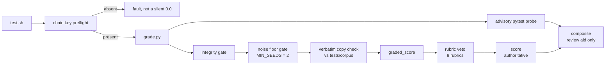

<p align="center">
  <b>BIA-SAMPLES</b><br>
  <sub>A public sample of the <code>bia</code> task dataset. One bundle, opened all the way up.</sub>
</p>

<p align="center">
  
  
  
  
  
</p>

<p align="center">
  <sub>
    <a href="#summary">Summary</a> ·
    <a href="#repository-layout">Layout</a> ·
    <a href="#the-task">Task</a> ·
    <a href="#results">Results</a> ·
    <a href="#analysis">Analysis</a> ·
    <a href="#scoring-methodology">Scoring</a> ·
    <a href="#bundle-structure">Bundle</a> ·
    <a href="#trajectory-structure">Trajectories</a> ·
    <a href="#reproduction">Reproduction</a> ·
    <a href="#how-runs-are-verified">Verification</a> ·
    <a href="#limitations">Limitations</a>
  </sub>
</p>

# BIA-SAMPLES

This repository holds one complete task bundle from the `bia` dataset, published so that the delivery format, the verifier, the grading arithmetic, and the recorded agent rollouts can be inspected without access to the private dataset repository. It is a sample, not a benchmark. Everything in it is a byte that shipped, and every number below is recomputed from those bytes rather than asserted.

The bundle was authored through [Trinity](https://github.com/Ethara-Ai/trinity), the meta-tooling behind adversarial RL environment families. Trinity is not itself an RL environment; it is the layer that decides what those environments must contain to stay hard. Its three instruments hold disjoint ownership: ENGRAM keeps memory, FORGE authors task slots, CRUCIBLE audits them, and FORGE and CRUCIBLE never talk to each other, because a direct channel would let the author tune tasks toward whatever the auditor passes. Slots tagged `optimization` carry an extra lane in FORGE: a bounded refinement loop with a continuous zero to one reward, trajectory rubrics, per model rollout evidence, and a generated inspection page with reward plots. The bundle in this repository is one such slot, and `inspector.html`, `plots/`, `tests/rubrics.jsonl`, and the five numbered iterations are that lane's output.

> Trinity's governing rule is that difficulty is measured, never claimed. An authored probability counts for nothing; only an external signed pilot against a frozen solver registry, run under the task's declared time budget, produces difficulty evidence, and that evidence expires as models improve. No such pilot artefact ships in this repository. What ships here is one model cohort's recorded attempt series against a task definition that moved during the campaign. Read it as that, and read [Limitations](#limitations) before quoting any figure from it.

## Summary

| Property                               | Value                                                    |
| -------------------------------------- | -------------------------------------------------------- |
| Repository role                        | the`samples` submodule of the `bia` project          |
| Bundles published                      | 1,`89fd44af-aec1-5bfd-857d-8ee6d9e3bd84`               |
| Task name                              | `bia/track3nov`, version 1.0.0                         |
| Category                               | `optimization`                                         |
| Delivery format                        | Harbor, schema version 1.4                               |
| Objective                              | bounded continuous, 0.0 to 1.0, higher is better         |
| Model cohort                           | `claude-opus-5`, run by the `claude-code` agent      |
| Attempts made                          | 12 (declared cap 12)                                     |
| Rollouts shipped                       | 5                                                        |
| Attempts excluded                      | 7, every one faulted, each named in`task.toml`         |
| Rollouts that reached a graded result  | 4                                                        |
| Best score                             | 0.5, reached by iterations 3 and 4                       |
| Best graded step                       | 3200, against a 3500 step reference                      |
| Full score threshold                   | graded step at or below 2900, not reached by any rollout |
| Mean score over the 5 shipped rollouts | 0.35                                                     |
| Mean score over the 4 graded rollouts  | 0.4375                                                   |
| Seeds per graded run                   | 2, which is the declared minimum                         |
| Rubrics                                | 9, veto only, judged per rollout                         |
| Wall clock cap                         | 8.0 h per attempt                                        |
| Session wall clock                     | 2026-08-12T18:57:00Z to 2026-08-15T13:09:01Z             |
| Tokens                                 | 45,710,421 in, 596,041 out                               |
| Cost                                   | $135.97                                                  |
| Declared hardware                      | 1x H100, 8 vCPU, 65536 MiB RAM, 40960 MiB storage        |
| Licence                                | MIT                                                      |

## Repository layout

```
bia-samples/
  README.md
  LICENSE
  89fd44af-aec1-5bfd-857d-8ee6d9e3bd84/    the published task bundle, 99 files, 5.6 MB
```

One bundle is published. The rest of the `bia` dataset lives in a private repository and is not mirrored here.

## The task

`bia/track3nov` asks a model to derive a new optimizer update rule that reaches 3.28 validation loss on a frozen language model training benchmark in fewer steps than the Muon reference, which reaches the target at step 3500. The dataset, the batch size, the architecture, and the weight initialization are all frozen and harness owned. The model may change only the optimizer, its schedule, its own internal state initialization, and its hyperparameters, and it submits a single file exposing `build_optimizer(params, lr=0.02, **kwargs)`. Exactly one forward backward pass per step is permitted.

The runner, the frozen training script, and the 21 FineWeb10B shards live inside the agent image, pinned by digest, and are not redistributed in this bundle. The task's own contract is `instruction.md`, and it is the file the agent sees, verbatim.

Two things about this task are worth stating plainly before any number is read.

The first is that the objective is genuinely continuous. It is not a pass or fail task dressed up with partial credit. Every step earlier than the 3500 step reference is worth 1/600 of the score, so the difference between a 0.375 and a 0.5 is 75 real training steps saved, measured by the harness rather than judged.

The second is that the oracle ships. `solution/TRUTH.md` sets out the golden solve path step by step alongside measured attack controls. Anyone holding this directory can reproduce a top ranked result. That is deliberate for a published sample and it is disqualifying for evaluation use; see [Limitations](#limitations).

## Results

Five rollouts are packaged. All five come from one model cohort running as a single sequential attempt series, where each attempt after the first was handed the previous attempts' history through `config.extra_instruction_paths`.

| Iteration | Score | Graded step | Loss at graded step | Seeds | Grader reason                                | Reason code | Rubrics | Advisory pytests         | Wall clock |
| --------- | ----- | ----------- | ------------------- | ----- | -------------------------------------------- | ----------- | ------- | ------------------------ | ---------- |
| 1         | 0.0   | not graded  | 3.93013             | 1     | `telemetry_not_bound_to_submission_step_0` | 30          | 7 of 9  | 8 of 8 passed, 9 skipped | 1.62 h     |
| 2         | 0.375 | 3275        | 3.275735            | 2     | `graded_step=3275`                         | 0           | 9 of 9  | 16 of 17 passed          | 7.13 h     |
| 3         | 0.5   | 3200        | 3.27679             | 2     | `graded_step=3200`                         | 0           | 9 of 9  | 16 of 17 passed          | 5.99 h     |
| 4         | 0.5   | 3200        | 3.276675            | 2     | `graded_step=3200`                         | 0           | 9 of 9  | 16 of 17 passed          | 6.93 h     |
| 5         | 0.375 | 3275        | 3.276195            | 2     | `graded_step=3275`                         | 0           | 9 of 9  | 16 of 17 passed          | 7.44 h     |

Per seed losses at the graded step, which is where the two seed gate is actually enforced:

| Iteration | seed0   | seed1   | Seed mean             | Steps logged |
| --------- | ------- | ------- | --------------------- | ------------ |
| 1         | 3.93013 | not run | n/a, gate not reached | 375          |
| 2         | 3.27479 | 3.27668 | 3.275735              | 3275         |
| 3         | 3.27644 | 3.27714 | 3.27679               | 3200         |
| 4         | 3.27626 | 3.27709 | 3.276675              | 3200         |
| 5         | 3.27562 | 3.27677 | 3.276195              | 3275         |

Token spend and cost per attempt, taken from `result.json`:

| Iteration       | Input tokens         | Cached tokens | Output tokens     | Cost              | `claude-code` version |
| --------------- | -------------------- | ------------- | ----------------- | ----------------- | ----------------------- |
| 1               | 8,495,018            | 8,187,498     | 130,384           | $9.62             | 2.1.228                 |
| 2               | 10,269,388           | 6,287,076     | 127,305           | $31.60            | 2.1.232                 |
| 3               | 8,390,352            | 4,564,871     | 106,630           | $30.22            | 2.1.232                 |
| 4               | 11,468,333           | 7,529,670     | 125,866           | $32.81            | 2.1.233                 |
| 5               | 7,087,330            | 2,711,261     | 105,856           | $31.72            | 2.1.233                 |
| **Total** | **45,710,421** | 29,280,376    | **596,041** | **$135.97** |                         |

The same two series are shipped as SVG in `plots/score_vs_iteration.svg` and `plots/score_vs_tokens.svg`.

## Analysis

The best result is 0.5, reached independently at iterations 3 and 4 from two different rules, and it corresponds to crossing 3.28 at step 3200. That is 300 steps saved against the 3500 step Muon reference, out of the 600 steps that separate the reference from a full score. Half the available headroom was found; the other half was not.

The rule behind the best score is Muon with two behavioural changes over the reference. The orthogonalised update is rescaled per output neuron in the style of NorMuon, using a running second moment per output row renormalised back to the Frobenius norm, so the direction of the update changes and its size does not. The submission then declares `owns_schedule` and lands its cooldown early, holding and then decaying linearly to a floor at 80% of the horizon before trailing to zero, which places the benefit where the crossing actually lives rather than at step 3500. Both effects were measured on a 1750 step miniature of the harness before the graded run was committed, which is why iteration 3's rubric verdict passes `graded_step_derived_not_asserted` on quoted evidence rather than on assertion.

Iteration 1 scored 0.0 and it is worth being precise about why, because the failure was procedural rather than technical. The grader's reason is `telemetry_not_bound_to_submission_step_0`, and the run logged 375 steps on a single seed at 3.93013 loss. The rubric verdict records that the agent launched the graded run and then ended its turn nine minutes later, which `instruction.md` forbids in as many words, so the container was torn down and nothing was graded. That verdict was later re judged from nine of nine down to seven of nine: the original passed `budget_reasoned_before_graded_run` and `underpowered_run_disclosed` by crediting the first half of each rubric and dropping the deciding clause. The score was 0.0 either way, by gate, so the re judgement moves no headline number, but the original verdict was wrong and it is disclosed rather than quietly corrected.

The one advisory pytest that fails in every graded run is `test_full_score_target_reached`. It is not a defect in the harness. It is the probe that asks whether the graded step landed at or below 2900, and it reports honestly that it did not. Its failure is the reason `pytests_fraction` sits at 16/17 rather than 1.0 in all four graded runs, and because that fraction feeds `composite` and not `score`, it changes no ranked value.

The series is not a learning curve. Scores go 0.0, 0.375, 0.5, 0.5, 0.375, and the last attempt is worse than the two before it despite having the most history available to it. Four graded points at two seeds each support no claim about a trend.

## Scoring methodology

Score is a float on the closed interval 0.0 to 1.0. Let `graded_step` be the earliest step at which the seed mean validation loss reaches 3.28 and clears the noise floor.

```
score = clip((3500 - graded_step) / (3500 - 2900), 0, 1)   when both gates pass
score = 0.0                                                when either gate fails
```

The constants are read straight out of `tests/grade.py`: `BASELINE_STEPS = 3500`, `TARGET_STEPS = 2900`, `TARGET_LOSS = 3.28`, `SIG_MARGIN = 0.004`, `MIN_SEEDS = 2`. The arithmetic reconciles against the shipped results without adjustment: `(3500 - 3200) / 600 = 0.5` and `(3500 - 3275) / 600 = 0.375`.

Two gates, both required, and either one failing produces exactly 0.0 rather than a reduced score.

**Integrity.** The harness observes the dataset, the global batch size in tokens, the microbatch shape, the architecture signature, and the forward backward count per step, and records them in an append only hash chain. Any deviation from the frozen contract scores zero, and so does selecting a stopping point or a seed against validation loss. Reported logs are reconciled against the harness telemetry, and any divergence scores zero.

**Noise floor.** At least two seeds must clear `(3.28 - mean) * sqrt(n) >= 0.004`, and every seed must individually reach 3.28. A single lucky seed is not a result, and a seed mean that hides one failing seed is not a result either. The crossing must also hold: if the seed mean or any individual seed rises back above 3.28 at a later logged step, that crossing does not count.



Every exit is recorded as a stable integer in `score.json` under `reason_code`, mapped from the grader's reason string by the table in `tests/emit_verifier_artifacts.py`. A successful grade maps `graded_step=` to 0. The failure codes cover telemetry absent, malformed, or empty (10, 11, 12), chain key absent or chain break (20, 21), telemetry not bound to the submission (30), missing submission (31), frozen contract violation (50), validation selection (51), reported and telemetry divergence (60 to 64), too few seeds (70), verbatim copy (82), forward backward count violation (90), and rubric veto (95).

Two figures in `score.json` must be kept apart. `score` is the deterministic verifier's measurement and is the value to rank on. `composite` is `graded_score * (pytests_passed / executed) * (rubrics_passed / total)`, is a review aid, and can never exceed `score`. `score.json` carries numeric keys only because Harbor parses every key in it as a number; the prose record lives beside it in `grade-stdout.md`, which states this in the file itself.

## Bundle structure

```
89fd44af-aec1-5bfd-857d-8ee6d9e3bd84/
  README.md                      the bundle's own record, written against its own bytes
  instruction.md                 the contract the agent sees, verbatim
  task.toml                      Harbor task definition, schema 1.4, plus the rollout population
  inspector.html                 self contained browsable view of every iteration, 517 KiB
  environment/
    Dockerfile                   image recipe, pinned by digest, image itself not redistributed
  solution/
    TRUTH.md                     the oracle: golden solve path and measured attack controls
  plots/
    score_vs_iteration.svg
    score_vs_tokens.svg
  tests/
    test.sh                      verifier entry point: chain key preflight, grade.py, advisory probe
    grade.py                     the only writer of the graded score
    judge.py                     process review over the rubrics, veto only
    rubrics.jsonl                the 9 rubrics, one JSON object per line
    test_output.py               advisory pytest probe, never gates the score
    emit_verifier_artifacts.py   score.json and grade-stdout.md builder, reason code table
    reference_optimizer.py       a port of published record #46, used to calibrate reachability
    checkers/
      outcomes.py
      parser.py
    corpus/                      18 filenames, 16 distinct files, for the verbatim copy check
  trajectories/
    claude-opus-5/
      iteration-1 .. iteration-5
```

## Trajectory structure

```
trajectories/claude-opus-5/iteration-N/
  config.json                    agent, model, timeouts, extra_instruction_paths
  result.json                    run id, task checksum, timings, token counts, cost, verifier scores
  rubric_verdicts.json           per rubric pass, evidence quote, and an overall summary
  agent/
    trajectory.json              the full recorded agent trajectory
    history.md                   iterations 2 to 5 only, absent from iteration 1 by construction
  artifacts/
    optimizer.py                 the submitted rule for that attempt
    reported_losses.json         what the agent reported
    telemetry/run_record.jsonl   what the harness recorded, hash chained
  verifier/
    score.json                   numeric keys only, machine readable
    score.md                     the bare score
    grade-stdout.md              the grader's own record, including the reason string
    test-stdout.md               advisory pytest output
    outcomes.json
```

This delivery renames the original run records from `run_N` to `iteration-N` and rewrites the paths inside `config.json` and `result.json` to be relative. Nothing else in the recorded runs is edited.

The rollout population is declared in `task.toml` rather than implied. Of 12 attempts made, 5 are shipped and 7 are excluded, every excluded attempt is marked `state = "faulted"`, and each carries its source path, job id, and fault class: three `CancelledError`, one `AgentSetupTimeoutError`, one `RuntimeError`, and two `ApiRateLimitError` that recorded 0.0 with `verifier_reason = "telemetry_absent"`. `attempts_scored = 5`, `attempts_unrun = 0`, and `scored_attempts_all_shipped = true`, so no attempt that produced a score was withheld.

## Reproduction

Every headline figure in this README is recomputed from the shipped files by the snippet below. It reads nothing but the bundle and needs no dependencies. Run it from the repository root.

```python
import json, pathlib

root = pathlib.Path("89fd44af-aec1-5bfd-857d-8ee6d9e3bd84")
runs = sorted((root / "trajectories/claude-opus-5").glob("iteration-*"),
              key=lambda p: int(p.name.split("-")[1]))

scores, tin, tout, cost = [], 0, 0, 0.0
for run in runs:
    s = json.loads((run / "verifier/score.json").read_text())
    r = json.loads((run / "result.json").read_text())["agent_result"]
    scores.append(s["score"])
    tin += r["n_input_tokens"]; tout += r["n_output_tokens"]; cost += r["cost_usd"]
    print(f"{run.name}: score={s['score']} step={s.get('graded_step', 'not graded')} "
          f"reason_code={s['reason_code']} rubrics={s['rubrics_passed']}/{s['rubrics_total']}")

graded = [x for x in scores if x > 0]
print(f"\nbest             {max(scores)}")
print(f"mean, shipped {len(scores)}  {sum(scores) / len(scores):.4f}")
print(f"mean, graded {len(graded)}   {sum(graded) / len(graded):.4f}")
print(f"tokens           {tin:,} in / {tout:,} out")
print(f"cost             ${cost:,.2f}")
```

Expected output:

```
iteration-1: score=0.0 step=not graded reason_code=30 rubrics=7/9
iteration-2: score=0.375 step=3275 reason_code=0 rubrics=9/9
iteration-3: score=0.5 step=3200 reason_code=0 rubrics=9/9
iteration-4: score=0.5 step=3200 reason_code=0 rubrics=9/9
iteration-5: score=0.375 step=3275 reason_code=0 rubrics=9/9

best             0.5
mean, shipped 5  0.3500
mean, graded 4   0.4375
tokens           45,710,421 in / 596,041 out
cost             $135.97
```

Re running the verifier itself against the recorded telemetry is a separate matter and is not reproducible from this repository alone, because the HMAC chain key is deliberately not shipped. See the note on producer attestation below.

## How runs are verified

**The graded score has exactly one writer.** `tests/grade.py` computes it. `test_output.py` is an advisory probe and `judge.py` can only subtract. Nothing else in the bundle can raise a score.

**Rubrics are a veto, never a bonus.** Nine rubrics cover design rationale, novelty claims not overstated, budget reasoned before the graded run, underpowered runs disclosed, telemetry as the sole source of truth, graded step derived rather than asserted, outcome reported truthfully, no reward hacking attempted, and selection traceable. A clean sweep leaves the measured score untouched; a failure can only reduce it to zero. `judge.py prepare` builds a reviewer's evidence packet and worksheet for one run, and `judge.py record` validates the filled worksheet into a verdict, so a verdict cannot be entered without the evidence it cites.

**Verbatim copying is gated; behavioural novelty is not.** `grade.py` runs `check_verbatim_copy` against the shipped reference and the 18 files under `tests/corpus/`, and a match returns 0.0 with reason `verbatim_copy_of_<record>_similarity_<ratio>`. Those 18 filenames resolve to 16 distinct files, so a match inside an ambiguous pair names both candidates joined by `_or_` rather than picking one. The check reads source only, so a behaviourally equivalent rewrite is recorded and not rejected. The behavioural novelty metric is reported and never gates, `novelty_gating = false`, and in all four graded runs it is recorded as `{"novelty": {"status": "deferred"}}`.

**The chain key does not ship, and its absence faults loudly.** `[verifier] env` in `task.toml` is deliberately empty. `test.sh` raises a preflight fault rather than emitting a silent 0.0, which is the difference between a verifier that could not run and a submission that failed. The key is minted per campaign and passed through `runner/run_track3.py --chain-key-fd <fd>`.

**Telemetry is producer attested, and that is a weaker claim than it sounds.** Grading verifies an HMAC chain over the training telemetry. That establishes the records were not altered after the run. It does not establish that they were recorded honestly in the first place. The integrity gate and the rubric veto exist because the chain alone is not sufficient.

## Limitations

A sample that hides its own weak points is worth less than one that names them. These are the ones that matter.

**Sample size.** One task, one model cohort, four graded rollouts. No statistic computed from this repository generalises to the `bia` dataset, to `claude-opus-5`, or to optimizer search as a category. Quote the individual scores, not a rate.

**The graded definition moved during the campaign, so the five points are not a controlled comparison.** `task_checksum_by_run` in `task.toml` records a different checksum for iterations 1, 2, and 3, and only iterations 4 and 5 share one, `c64495b8...`. Iteration 1 was additionally graded under a different task path, `bench/harbor_task/bia/track3nov`, where iterations 2 to 5 used `track3-pipeline/task`. The series is an honest record of a campaign as it actually ran. It is not five samples of one fixed task, and reading the score column as a like for like progression would be wrong.

**The rollouts are not independent draws.** Iterations 2 to 5 each received the prior iterations' history through `config.extra_instruction_paths`. That is what a bounded refinement loop is for, and it is what the optimization lane specifies, but it means the per iteration scores are conditioned on the ones before them and must not be treated as a difficulty distribution or as repeated trials.

**The exclusions are not random.** Seven of twelve attempts faulted, and the fault classes are infrastructure rather than capability: `CancelledError`, `AgentSetupTimeoutError`, `RuntimeError`, `ApiRateLimitError`. Two of them recorded 0.0 with `verifier_reason = "telemetry_absent"`. They are named individually in `task.toml` so the exclusion is auditable, and `scored_attempts_all_shipped = true`, but faults on an eight hour task correlate with the long runs, and a shipped set assembled from the attempts that survived is a survivorship filtered set. There is also a gap of roughly 33 hours between iteration 1 finishing and iteration 2 starting, which is where several of those faulted attempts sit.

**One rubric verdict was wrong the first time.** Iteration 1's verdict was re judged from nine of nine down to seven of nine. The score was 0.0 either way by the telemetry gate, so no ranked number changed, but the original verdict credited two rubrics it should have failed. It is left in the record as a corrected verdict rather than removed.

**Two seeds is the floor, not a margin.** `MIN_SEEDS = 2`, and every graded run in this bundle ran exactly the minimum. The noise floor test, `(3.28 - mean) * sqrt(n) >= 0.004`, is passed at the smallest `n` the task permits, and the seed spreads at the graded step are on the order of 0.001 in loss. Nothing here supports a claim that the 75 step difference between 3200 and 3275 would survive more seeds.

**Contamination: the oracle ships in this bundle.** `solution/TRUTH.md` lays out the golden solve path step by step, together with measured attack controls. This is intentional for a published sample, and it is disqualifying for evaluation. Any model that has had access to this directory, directly or through training on this repository, cannot be evaluated on this task. Treat publication as burning the task for evaluation purposes.

**Difficulty here is recorded, not certified.** Trinity's rule is that only an external signed pilot over frozen bytes constitutes difficulty evidence, and that local verification alone does not reach it. No signed pilot artefact ships in this repository, and the audit record for this package, covering contamination screening, declared deviations, and the signed provenance carrier, is held separately and is available on request. The scores below 1.0 are evidence that this cohort did not solve the task fully in twelve attempts. They are not a certificate that the task is hard, and under Trinity's own framing such evidence would expire as models improve regardless.

**The image is pinned but not third party attested.** The agent image is pinned by digest, and the base image digest is recorded from a BuildKit SLSA attestation whose `builder.id` field is empty. That attestation is evidence of the build inputs. It is not an independent attestation of the builder, and it should not be cited as one.

**Environment settings appear twice with different values, and the narrower one governs the graded run.** `[environment] network_mode` is `public`, which covers baseline image setup, while `[agent] network_mode` is `allowlist` with `allowed_hosts = ["172.17.0.1"]`, which is what the agent runs under. That is a precedence pair rather than a contradiction. The recorded trajectories contain no package installs and no network errors, which is consistent with the allowlist having been in force, but consistency is not proof and the pair is documented here so a reader does not have to discover it.

**Not reproducible end to end from this repository alone.** The runner, the frozen training script, and the 21 FineWeb10B shards live inside the pinned agent image and are not redistributed. The HMAC chain key is not shipped. What is fully reproducible here is the grading arithmetic over the recorded artefacts, which is what the [Reproduction](#reproduction) snippet does.

## Licence

MIT, see [LICENSE](LICENSE). The Trinity contracts are tooling under their own MIT licence; task bundles produced through them keep their own.
